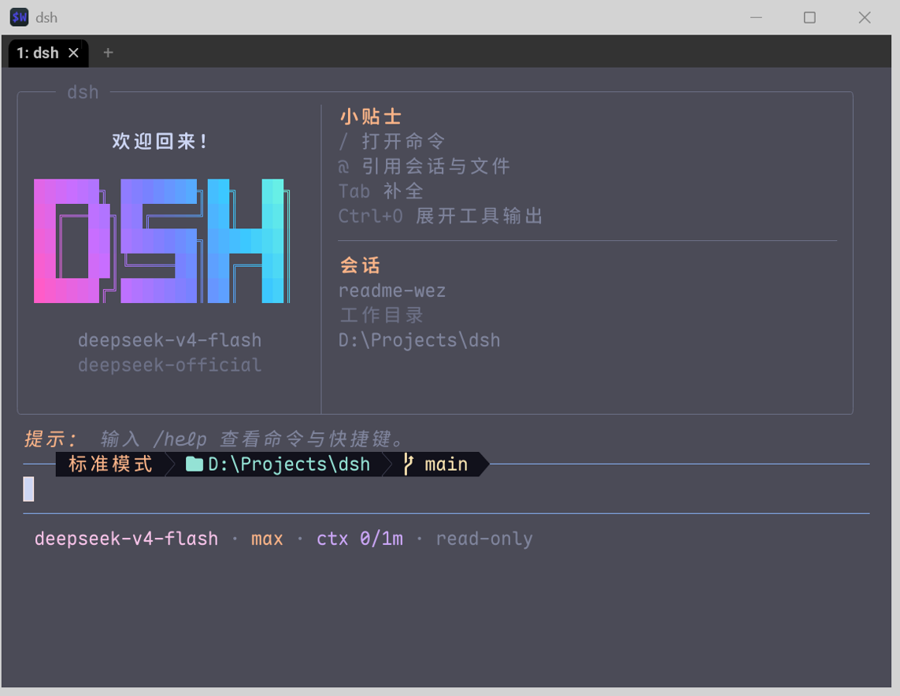
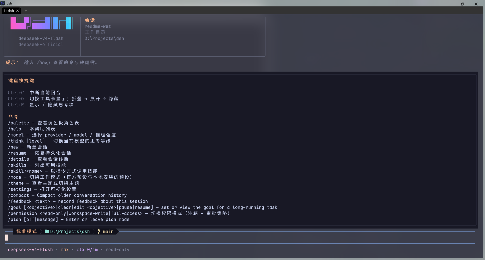

# dsh-omp-tui

## 重要提示！
- 本项目尚处于早期开发测试阶段，目前已可以作为一个tui工作，必要功能均已测试正常。
- 目前正在开发：wechat-claw通道的远程控制能力，优化settings面板及功能。
- 目前项目文档由ai完成，后续功能开发完全后会重新编写readme以增强可读性。

OMP 风格的 DeepSeek Harness（dsh）终端界面。它是一个独立的 profile bundle（插件），负责终端呈现、输入交互与会话相关的 TUI 能力；agent、模型、工具、持久化和沙箱仍由 dsh harness 提供。

## 目录

- [界面预览](#界面预览)
- [功能概览](#功能概览)
- [安装](#安装)
- [启动与日常使用](#启动与日常使用)
- [配置](#配置)
- [开发](#开发)
- [项目结构](#项目结构)
- [相关文档](#相关文档)
- [许可](#许可)

## 界面预览

截图来自本机 WezTerm 中实际启动的 `dsh --profile tui`。演示实例未配置 API key，因此截图聚焦于启动页、状态栏和内置帮助面板，不代表模型响应效果。

<p align="center">
  
</p>

欢迎页

<p align="center">
  
</p>

输入 `/help` 可查看快捷键和命令。工具卡支持折叠、展开和隐藏；助手正文、思考块、上下文卡和 `Output` 分隔栏使用独立的视觉层级。

## 功能概览

- **OMP 风格 TUI**：`dark-catppuccin` 默认主题、truecolor、Nerd Font 图标和 Powerline 状态栏。
- **响应式布局**：窄终端优先保留模式、工作目录、Git 与 `ctx`，空间不足时逐级压缩或隐藏低优先级字段。
- **会话管理**：支持新建、命名、恢复和进程内切换持久化会话。
- **模型与思考等级**：通过 `/model`、`/think` 选择 provider、model 和 reasoning effort。
- **工作模式**：支持 dsh 官方 `standard`、`minimal`、`code`、`cordis` 预设，也能发现本地安装的 agent preset。
- **权限模式**：通过 `/permission` 在 `read-only`、`workspace-write`、`full-access` 等部署可用预设间切换。
- **主题与本地化**：内置 `catppuccin`、`tokyo-night`，支持逐角色 RGB 覆盖；内置 `zh-CN` 与 `en`。
- **命令与补全**：支持斜杠命令、`@` 会话/文件引用、路径补全和参数补全。

## 安装

### 运行要求

| 项目 | 要求 |
|---|---|
| Node.js | `^22.19.0` 或 `>=24.0.0` |
| pnpm | `11.7.0` 或兼容的 pnpm 11 |
| dsh | `0.1.0-rc.6` |
| 终端 | 推荐支持 truecolor；Nerd Font 可获得完整图标显示 |

当前 dsh 仍处于 developer preview。首次安装建议固定 dsh 版本和插件 release tag。

### 安装 GitHub Release

没有 pnpm 时先安装固定版本：

```sh
npm install --global pnpm@11.7.0
```

然后安装当前 release tarball：

```sh
npx --yes @deepseek-ai/dsh@0.1.0-rc.6 plugin --profile tui add \
  https://github.com/mytianyi0712/dsh-tui-plugin-OhMyPi/releases/download/v0.1.1/dsh-omp-tui-0.1.1.tgz
```

tarball 已包含构建后的 `lib/`，用户机器无需编译本项目。

### 从 GitHub tag 安装

Git 安装会执行本项目的 `prepare` 构建。pnpm 11 默认阻止依赖构建脚本，因此必须显式允许本包：

```sh
npx --yes @deepseek-ai/dsh@0.1.0-rc.6 plugin --profile tui add \
  --allow-build=dsh-omp-tui \
  github:mytianyi0712/dsh-tui-plugin-OhMyPi#v0.1.1
```

固定 tag 比直接使用 `#main` 更容易复现。完整的升级、卸载和安装排障说明见 [`docs/INSTALL.md`](docs/INSTALL.md)。

## 启动与日常使用

### 启动会话

```sh
# 使用 npx
npx --yes @deepseek-ai/dsh@0.1.0-rc.6 --profile tui
npx --yes @deepseek-ai/dsh@0.1.0-rc.6 --profile tui --session my-id
npx --yes @deepseek-ai/dsh@0.1.0-rc.6 --profile tui --resume <session-id>

# 已安装 dsh launcher 后
dsh --profile tui
dsh --profile tui --session my-id
dsh --profile tui --resume <session-id>
```

`--resume` 与 `--session` 互斥。新会话只有在首次产生用户消息、助手消息或工具调用后才会落库；空白会话不会出现在 `/resume` 列表中。

### 快捷键

| 快捷键 | 作用 |
|---|---|
| `Ctrl+C` | 中断当前回合；2 秒内再次按下退出程序 |
| `Ctrl+O` | 工具卡显示循环：折叠 → 展开 → 隐藏 |
| `Ctrl+R` | 显示或隐藏思考块 |
| `Tab` | 补全当前斜杠命令、参数或路径 |
| `@` | 开始会话或文件引用补全 |

### 常用命令

| 命令 | 作用 |
|---|---|
| `/help` | 查看快捷键和完整命令列表 |
| `/model` | 选择 provider、model 和 reasoning effort，并持久化设置 |
| `/think [level]` | 切换当前模型的思考等级；无参时循环切换 |
| `/new` | 在当前项目、模型和权限模式下新建会话 |
| `/resume [id]` | 列出或切换当前项目的持久化会话 |
| `/details` | 查看会话标题、目录、模型、agent、tokens 和 context |
| `/mode [preset]` | 切换 dsh agent 组合；无参时循环切换 |
| `/permission [preset]` | 切换沙箱和审批策略 |
| `/theme [name]` | 查看或切换主题 |
| `/palette` | 查看当前主题实际使用的颜色角色 |
| `/settings` | 打开可视化设置 |
| `/skills` | 列出可用技能 |

`@[label](dsh-session:<id>)` 会将目标会话的模型可见快照注入当前会话。更多命令以运行中的 `/help` 为准。

### 微信远程桥接（WeChat iLink）

本 bundle 内置了从 OMP 迁移来的微信桥插件：通过腾讯官方 ClawBot / iLink 通道，
把 dsh 会话连接到微信，支持扫码登录、白名单/配对码、远程 `@dsh` 命令、自动进度
汇报与结果推送、`wechat_send` / `wechat_status` 工具，以及 ask 提问同步推送到微信。

```sh
# 在 dsh TUI 中扫码登录
/wechat-login

# 陌生微信用户会收到 6 位配对码，在 dsh 中批准
/wechat-pair 123456

# 查看桥状态
/wechat-status
```

微信里以 `@dsh` 开头的消息会被当作远程命令，不会进入会话（例如 `@dsh status`、
`@dsh models`、`@dsh think max`、`@dsh notify on`）。普通微信消息会直接注入当前
dsh 会话；模型可用 `wechat_send` 工具回复。

状态目录：`~/.dsh/wechat-ilink/`（可用环境变量 `DSH_WECHAT_ILINK_STATE` 覆盖）。
登录二维码同时写入 `~/.dsh/wechat-ilink/login-qr.txt`，方便无界面场景查看。

### 让裸 `dsh` 默认进入 TUI

项目提供 `scripts/dsh` 与 `scripts/dsh.cmd` 包装器。将 `scripts` 目录放到 `PATH` 前面后，裸 `dsh` 会自动注入 `--profile tui`；`web`、`plugin`、显式 `--profile`、帮助、版本和配置导出参数保持原样透传。

```sh
# Git Bash / zsh
export PATH="$HOME/dsh-omp-tui/scripts:$PATH"
dsh                         # 等价于 dsh --profile tui
dsh --resume <session-id>   # 自动补 profile
dsh web --port 8080         # 透传给官方 web 子命令

# Windows cmd / PowerShell
# 将 <仓库>\scripts 加入 PATH，或直接运行 <仓库>\scripts\dsh.cmd
```

需要指定真实 dsh 可执行文件时设置 `DSH_REAL`；设置 `DSH_DEBUG=1` 可以只打印包装器解析出的命令，不启动后端。

## 配置

### 模型连接

官方 DeepSeek API：

```sh
# Git Bash / zsh
export DEEPSEEK_API_KEY='your-key'

# PowerShell
$env:DEEPSEEK_API_KEY = 'your-key'
```

本地 OpenAI-compatible 网关：

```sh
# Git Bash / zsh
export DEEPSEEK_BASE_URL='http://localhost:3000/v1'

# PowerShell
$env:DEEPSEEK_BASE_URL = 'http://localhost:3000/v1'
```

环境变量必须在启动 dsh 的同一个 shell 中可见。启动后可用 `/model` 选择并持久化 provider、model 和思考等级。

### TUI profile 配置

在 profile 的 `cordis.patch.yml` 中配置 `id: tui` 行，或使用 dsh settings 注入同一配置：

```yaml
- id: tui
  config:
    mode: standard              # standard | minimal | code | cordis 或本地 preset id
    locale: zh-CN               # zh-CN | en
    defaultReasoningEffort: max
    theme:
      name: catppuccin          # catppuccin | tokyo-night
      custom:
        accent: [255, 100, 100]
        userMessageBg: [24, 24, 37]
```

- `mode` 只对空白会话生效；切换结果会写入会话日志，恢复会话时沿用。
- `/theme` 和 `/settings` 的选择在存在官方 settings provider 时写入 `$DSH_HOME/settings.yaml`。
- `theme.custom` 只接受 RGB 三元组；未知角色和非法值会被忽略。
- `/permission` 的可用选项以当前部署的权限预设为准，自定义 preset 也会进入命令提示和补全。

## 开发

```sh
pnpm install
pnpm run typecheck
pnpm run test
pnpm run prepare
```

常用辅助命令：

```sh
pnpm run check
node --experimental-transform-types scripts/perf-probe.ts
```

测试使用 Node 原生 `node:test` 运行 `.ts` 文件，不依赖兄弟 harness checkout。修改源码后重新运行 `pnpm run prepare`，再使用 `link:` profile 验证：

```sh
npx --yes @deepseek-ai/dsh@0.1.0-rc.6 plugin --profile tui add link:.
```

dsh 仍处于 rc 阶段。上游接口变更时，先更新 [`docs/contracts.md`](docs/contracts.md)，再同步代码、依赖版本，并运行测试与 `dsh --profile tui` 实机 smoke。

## 项目结构

```text
src/                    TUI、主题、提示、会话和设置实现
src/components/         状态栏、消息、工具卡和转录组件
tests/                  node:test 行为测试
cordis.patch.yml        将本 bundle 组合进 dsh profile 的配置
scripts/dsh*             裸 dsh 包装器
patches/                pi-tui 的 vendored pnpm patch 与声明
docs/                   安装、发布和 harness 合约文档
docs/assets/            README 使用的实机截图
```

架构边界保持简单：dsh harness 负责 agent、模型、工具、持久化与沙箱；本仓库负责终端呈现和输入。渲染层使用 `@earendil-works/pi-tui@0.80.7`，并通过 vendored patch 打入发布包，消费者无需单独安装 pi-tui。

## 相关文档

- [`docs/INSTALL.md`](docs/INSTALL.md)：安装、升级、卸载、本地开发和常见问题
- [`docs/contracts.md`](docs/contracts.md)：dsh harness 合约唯一真相源
- [`docs/PUBLISHING.md`](docs/PUBLISHING.md)：GitHub release、tarball 和 CI 发布流程
- [`CHANGELOG.md`](CHANGELOG.md)：版本变更记录

## 许可

BSD-3-Clause。`patches/@earendil-works__pi-tui@0.80.7.patch` vendored from `turtle1999/turtle-ui`（BSD-3），完整声明见 [`patches/NOTICE.md`](patches/NOTICE.md)。
